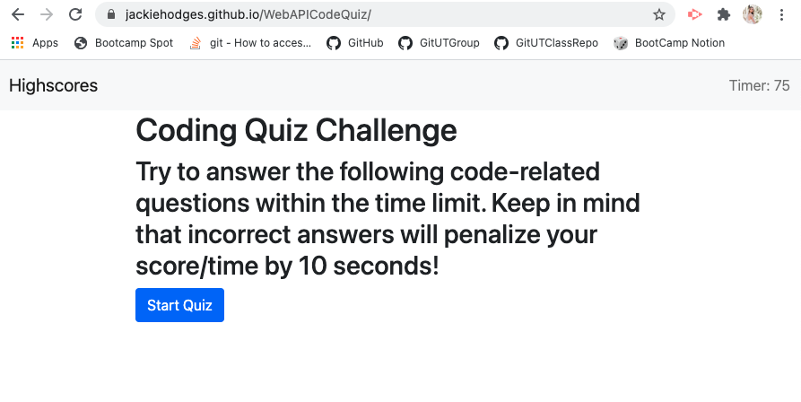
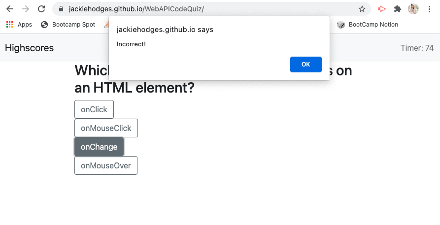
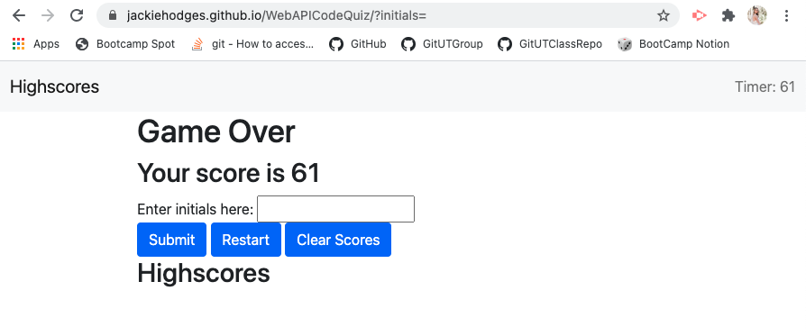
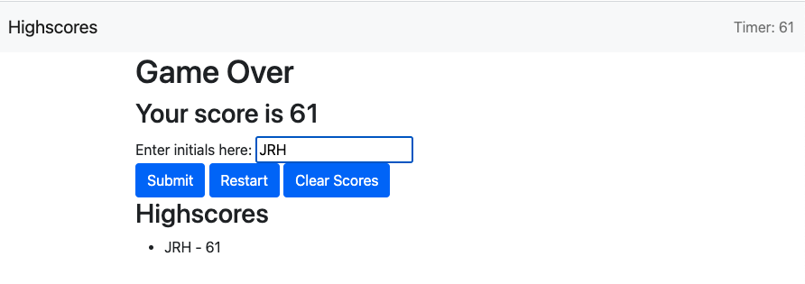

# WebAPICodeQuiz
Web API: Code Quiz

## Description

This Code Quiz is a timed coding quiz with multiple choice answers. To do this, JavaScript was implemented to dynamically update the HTML and CSS through the various questions and answer choices. 

The quiz begins when the Start Quiz button is selected. This begins a timer that allows the user only 75 seconds to complete the quiz. The question and answer choices are then listed.

Using event listeners, the answer choice that is picked has its value read to determine if it is correct or not. If the answer choice is incorrect, 10 seconds are removed from the time as a penalty. Whether an incorrect or correct answer is chosen, the user is presented another question with new answer choices. 

When the timer reaches 0 or the user answers all questions, the game is over. The highscores are then displayed (if any) from the local storage. The user can input their initials to have their score saved. From there, the user can either restart the game or clear the existing highscores.

The styling was minimal due to the use of bootstrap.

## Table of Contents

* [Installation](#installation)
* [Usage](#usage)
* [Credits](#credits)

## Installation

To install, pull repository and open html file in browser. Repository can be found here: [Web API Code Quiz Repo](https://github.com/JackieHodges/WebAPICodeQuiz)

Otherwise, the github page can be found here: [Web API Code Quiz Webpage](https://jackiehodges.github.io/WebAPICodeQuiz/)

## Usage

Below are screenshots of the page:

## Credits

The question and answer choices used in this quiz were taken from w3schools.com. Link can be found here: [w3Schools JavaScript Quiz](https://www.w3schools.com/js/js_quiz.asp)

